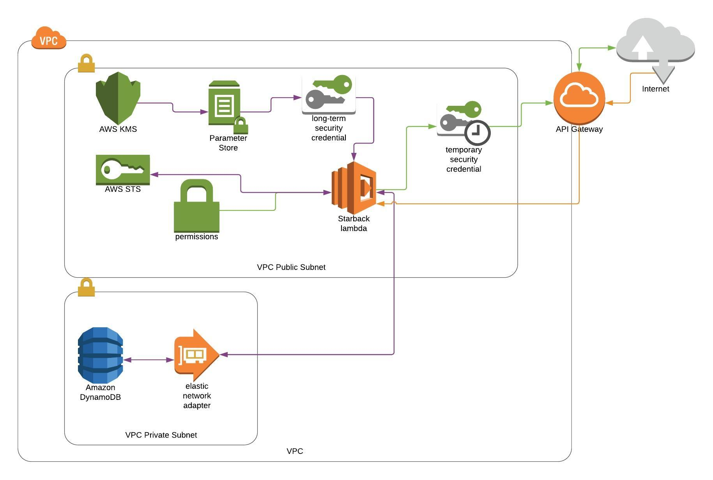

# Starback #
Short-term, Role-based access credentials for AWS (STaRBACk).

> **Note** There is no code here (yet) as I need to ask my employer whether this contravenes my employment contract or
> not as I wrote a similiar system for them.

## Contents ##
- [Features](#features)
- [How it Works](#howitworks)
- [Installation](#installation)

Rather than managing multiple user credentials for AWS and giving users more access than they actually need the
Starback system allows you to create roles for users, with just enough access rights for what they need to do.

## Features ##
* Availability of 99.9% as core components are multi-az and (optionally) mult-region.
* Lambda and API Gateway based.
* Generates short term access and secret keys with a session token and (optionally) a federated console login url
  session.
* Role based access keys - just enough access to AWS services and no more.
* Consistent log trail of which key did what and to whom it was issued.
* Same key is used for CLI and console session, enables complete tracking of user actions.
* Logs into Cloudwatch with (optionally) Cloudtrail tracking.
* Simple user and access management:
  * Define roles using IAM policies
  * Create users with expiring access tokens to ensure that access is always current.
  * Assign users into groups
  * Assign roles to groups of users and/or individuals.
  * Cascading roles, where higher access levels automatically allow lower level roles to be requested.
* Automatic application access management. So long as the user running the application has the required levels of
  access then the application can be written to automatically manage it's own credentials.

[Contents](#toc)

## How it Works ##
.
* A request is sent via the API Gateway (orange lines)
* The API GW triggers the Lambda passing in the body parameters (user name, role requested) (orange)
* The Lambda retrieves it's long term security credentials from the SSM Parameter Store where they are held encrypted
  with a restricted Key Management Service encryption key.
* The Lambda, using the long term credentials supplied via the SSM Parameter Store, looks up the user in the DynamoDb
  table (purple).
* The Lambda checks that the user exists, is enabled and is allowed to assume the requested role (purple).
* The Lambda asks the Security Token Service to assume the requested role (purple).
* The STS sends back an Access Key ID, a Secret Access Key and a Session Token (purple).
* (optionally) The Lambda asks the Federation Service (not shown in diagram) for a login url based on the access key
  supplied by the STS (purple).
* The Lambda returns the access credentials (and the login url) back to the user (green).

[Contents](#toc)

## Installation ##
see [INSTALL](INSTALL.md) for full installation and AWS services setup.

[Contents](#toc)
